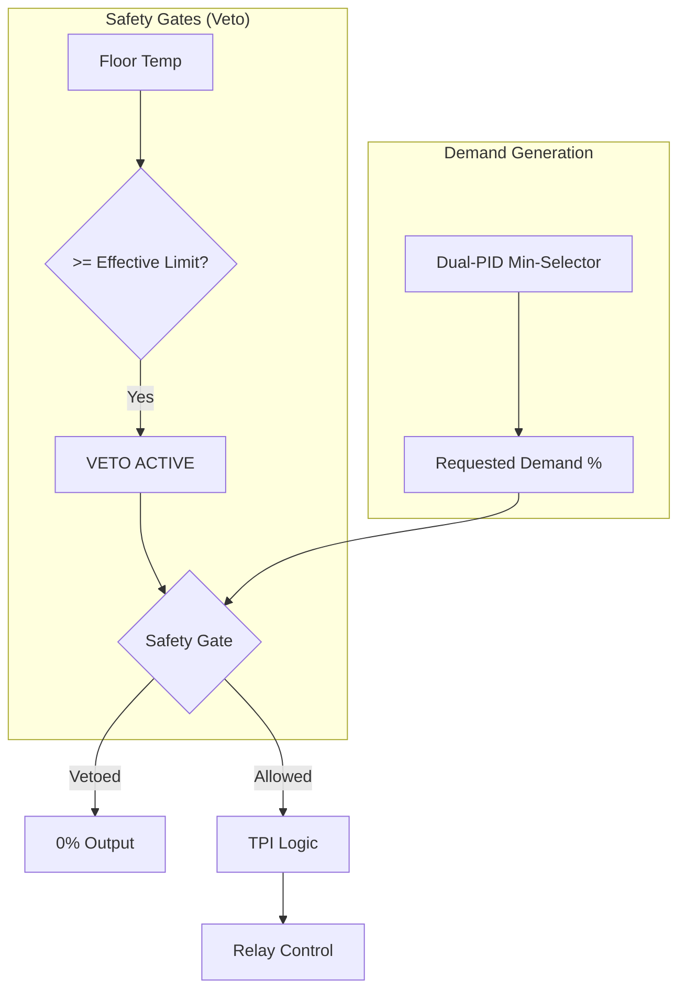
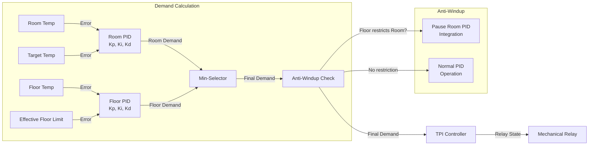

# IR Floor Heating Integration

An advanced Home Assistant integration for controlling electric infrared (IR) floor heating systems using a dual-sensor topology with Time Proportional & Integral (TPI) control algorithm.

## Overview

This integration provides sophisticated control of electric floor heating systems by monitoring both room air temperature and floor surface temperature. It implements a "Safety-Comfort-Demand" hierarchy to protect flooring materials while maintaining occupant comfort.

The specific system under analysis involves a high-load resistive heating element managed by a dual-sensor topology. The governing logic satisfies a primary setpoint for ambient air temperature while strictly adhering to two hierarchical constraints: an absolute maximum floor temperature to prevent material degradation, and a differential maximum floor temperature relative to the room air to ensure physiological comfort.

## Theoretical Background

### The Operational Context

Electric underfloor heating systems, particularly those utilizing carbon film technology, operate on the principle of Joule heating. The control problem arises from the decoupling of the heat source (the floor) and the controlled variable (the room air temperature). In modern construction involving temperature-sensitive materials like engineered wood, laminate, or vinyl, unbounded operation poses a severe risk of warping, delamination, or discoloration. Furthermore, physiological studies indicate that floor surface temperatures exceeding 29°C (84°F) can cause discomfort.

### Thermodynamics of the Heating Plant

The plant consists of the electric IR film, the floor assembly, and the enclosed air volume.

- **Rapid Generation**: Carbon strips reach operating temperature within seconds.
- **Conductive Latency**: The heat must traverse the flooring stack, introducing a transport delay (dead time) of 10 to 30 minutes.
- **Thermal Storage**: The floor assembly acts as a thermal capacitor, smoothing rapid switching but introducing inertia.

### Electromechanical Switching Constraints

The selection of the control algorithm is constrained by the actuation hardware, typically a mechanical relay.

- **Relay Physics**: Switching a high-current load causes contact erosion due to arcing.
- **PWM Incompatibility**: Standard high-frequency PWM would destroy a mechanical relay in days.
- **TPI Solution**: Time Proportional & Integral (TPI) control, or "Slow PWM," adapts PID logic to a time window measured in minutes, ensuring relay longevity while providing precise control.

#### Relay Life Calculation

Standard mechanical relays have an electrical life of ~100,000 cycles at full load.

- **PWM (1 Hz)**: 86,400 cycles/day → Failure in ~1.2 days.
- **Standard Thermostat (6 CPH)**: ~26,000 cycles/year → Failure in ~3.8 years.
- **Optimized TPI (4 CPH)**: ~17,500 cycles/year → Service life > 5-10 years.

### The Veto Architecture

The controller implements a **"Veto Architecture"** that serves as a high-priority safety layer. While the Dual-PID Min-Selector (described below) provides smooth, proactive temperature limiting, the Veto system acts as a hard **Safety Gate**. It possesses the authority to immediately block any heat request if floor temperature limits are exceeded, regardless of PID demand.



#### Unique Feature: Differential Limiting

Most commercial thermostats only enforce an absolute floor limit (e.g., 28°C). This integration uniquely implements a **Differential Limit** ($T_{floor} - T_{room} \le \Delta_{max}$), ensuring the floor never feels uncomfortably hot relative to the room, preventing thermal shock to materials and the "hot feet" phenomenon.

**Defining the Constraints:**

- $T_{room}$: Current Air Temperature
- $T_{floor}$: Current Floor Temperature
- $L_{abs}$: Absolute Maximum Floor Temperature (e.g., 28°C)
- $\Delta_{max}$: Maximum Differential (default: 8°C)

**The Logic:**
The differential limit creates a floating ceiling for the floor temperature:
$$Limit_{diff} = T_{room} + \Delta_{max}$$

The effective limit for the floor at any given moment is the stricter (lower) of the absolute limit and the differential limit:
$$Limit_{effective} = \min(L_{abs}, \ T_{room} + \Delta_{max})$$

**Operational Examples:**
Assuming $L_{abs} = 28^{\circ}$C and $\Delta_{max} = 8^{\circ}$C:

1.  **Scenario A (Cold Room):** $T_{room} = 15^{\circ}$C

    - $Limit_{effective} = \min(28, 15 + 8) = 23^{\circ}$C
    - _Result:_ Floor is limited to 23°C to prevent thermal shock.

2.  **Scenario B (Warm Room):** $T_{room} = 22^{\circ}$C

    - $Limit_{effective} = \min(28, 22 + 8) = 30^{\circ}$C (capped to 28°C)
    - _Result:_ Absolute limit takes over at 28°C.

#### Control Logic Pseudocode

```cpp
// Simplified Control Logic
void loop() {
  // 1. Calculate Limits
  float effective_limit = min(MAX_FLOOR_ABS, room_temp + MAX_DIFF);

  // 2. Safety Veto
  bool safety_veto = false;
  if (floor_temp >= effective_limit) {
    safety_veto = true;
  } else if (floor_temp > (effective_limit - HYSTERESIS) && was_vetoed) {
    safety_veto = true; // Hysteresis
  }

  // 3. PID Demand
  float demand = calculate_pid(target - room_temp);
  if (safety_veto) demand = 0;

  // 4. TPI Actuation
  control_relay(demand);
}
```

## Dual-PID Min-Selector Architecture

This integration implements an advanced **Dual-PID "Select-Low" (Min-Selector) Architecture** to maximize heating performance while respecting floor temperature limits.

### How It Works

The system uses two independent PID controllers operating in parallel:

1. **Room Temperature PID**: Calculates heating demand to reach the user's target temperature
2. **Floor Limiter PID**: Calculates the maximum allowable heating demand based on the current floor temperature relative to the effective floor limit

The final demand is the **minimum** of these two values (hence "Select-Low"), ensuring that whichever constraint is tighter takes precedence.

### Min-Selector Logic with Anti-Windup



**Key Features of the Dual-PID Architecture:**

- **Smooth Floor Limit Approach**: The floor PID smoothly approaches the limit instead of hard cutoff, reducing temperature oscillation
- **Anti-Windup Coordination**: When the floor limit restricts heating, the room PID's integral term is paused to prevent windup
- **Decoupled Tuning**: Room and floor controllers can be tuned independently for optimal performance
- **Diagnostic Visibility**: All internal states (both PID demands, integral errors, selected demand) are exposed via sensors for fine-tuning

### Room Temperature PID

Controls heating demand to reach the user's target temperature.

- **Default Kp**: 80.0 (aggressive proportional response)
- **Default Ki**: 2.0 (medium integral action for steady-state accuracy)
- **Default Kd**: 15.0 (significant damping for smooth response)

### Floor Limiter PID

Controls the maximum heating demand based on floor temperature approaching the effective limit.

- **Default Kp**: 20.0 (moderate proportional feedback)
- **Default Ki**: 0.5 (gentle integral for smooth limit approach)
- **Default Kd**: 10.0 (damping to prevent oscillation at the limit)

This soft-limit approach allows the floor temperature to smoothly approach the limit without hard cutoffs, improving thermal efficiency and reducing comfort disruptions.

## Key Features

### Dual-Sensor Control

- **Room Temperature Sensor**: Primary control variable for occupant comfort.
- **Floor Temperature Sensor**: Safety monitoring to prevent material damage.

### Advanced Safety Limits

- **Absolute Maximum Floor Temperature**: Protects flooring materials (default: 28°C).
- **Differential Maximum**: Limits temperature difference between floor and room (default: 8.0°C).
- **Dynamic Limit Calculation**: Effective floor limit adapts based on current room temperature.

### TPI (Time Proportional & Integral) Algorithm

- **Relay Protection**: Designed for mechanical relays.
- **Cycle Period**: Configurable (default: 900 seconds).
- **Minimum Cycle Duration**: Prevents excessive relay switching (default: 60 seconds).
- **PID Control**: Precise temperature regulation (Kp=80.0, Ki=2.0, Kd=15.0).

### Boost Mode

- Temporarily relaxes the differential limit when the room is far from the target temperature.
- Enables faster warm-up from cold conditions.
- Prevents "control stalling" where floor temperature is capped too low to effectively heat the room.
- **Activation**: When error ≥ `boost_temp_diff` (default 1.5°C).
- **Effect**: Increases effective floor limit to allow higher heat output.

## Configuration Parameters

| Parameter             | Description                                 | Default  |
| --------------------- | ------------------------------------------- | -------- |
| `heater`              | Switch entity controlling the heating relay | Required |
| `room_sensor`         | Temperature sensor for room air             | Required |
| `floor_sensor`        | Temperature sensor for floor surface        | Required |
| `max_floor_temp`      | Absolute maximum floor temperature (°C)     | 28.0     |
| `max_floor_temp_diff` | Maximum floor-room differential (°C)        | 8.0      |
| `cycle_period`        | TPI cycle duration (seconds)                | 900      |
| `min_cycle_duration`  | Minimum on/off time (seconds)               | 60       |
| `boost_mode`          | Enable boost mode for faster warm-up        | true     |
| `boost_temp_diff`     | Temperature error to activate boost (°C)    | 1.5      |
| `pid_kp`              | Room PID Proportional gain                  | 80.0     |
| `pid_ki`              | Room PID Integral gain                      | 2.0      |
| `pid_kd`              | Room PID Derivative gain                    | 15.0     |
| `floor_pid_kp`        | Floor Limiter PID Proportional gain         | 20.0     |
| `floor_pid_ki`        | Floor Limiter PID Integral gain             | 0.5      |
| `floor_pid_kd`        | Floor Limiter PID Derivative gain           | 10.0     |
| `safety_hysteresis`   | Hysteresis for safety limit (°C)            | 0.25     |

## Diagnostic Sensors

The integration provides several diagnostic sensors to monitor internal state (disabled by default):

- `sensor.<name>_demand_percent`: Final heating demand (0-100%, result of min-selector).
- `sensor.<name>_room_pid_demand`: Room temperature PID demand (0-100%).
- `sensor.<name>_floor_pid_demand`: Floor limiter PID demand (0-100%).
- `sensor.<name>_effective_floor_limit`: Current dynamic floor temperature limit (°C).
- `sensor.<name>_safety_veto_active`: Binary state indicating if safety limits are restricting heating (0/1).
- `sensor.<name>_integral_error`: Room PID accumulated integral error for diagnostics (°C·s).
- `sensor.<name>_room_integral_error`: Room PID integral error term (°C·s).
- `sensor.<name>_floor_integral_error`: Floor limiter PID integral error term (°C·s).

## State Attributes

The climate entity exposes the following additional attributes:

- `floor_temperature`: Current floor surface temperature.
- `room_temperature`: Current room air temperature.
- `effective_floor_limit`: Dynamically calculated floor temperature limit.
- `demand_percent`: Calculated heating demand.
- `safety_veto_active`: Whether safety limits are currently restricting heating.
- `room_pid_demand`: Room temperature PID demand (0-100%).
- `floor_pid_demand`: Floor limiter PID demand (0-100%).

## Use Cases

### Engineered Wood Floors

- Protects against warping, delamination, and shrinkage.
- Maintains surface temperature below manufacturer's specified limit (typically 27-28°C).

### Vinyl and LVT

- Prevents softening or discoloration from excessive heat.

### Comfort Applications

- Prevents uncomfortable hot floors in cold rooms.
- Gradual warm-up prevents thermal shock to flooring materials.
- Maintains ASHRAE 55 / ISO 7730 comfort standards.

## References

Design based on technical analysis of electric radiant floor heating control, emphasizing:

- Relay cycle-life preservation (NEMA ICS 5-2017 standards).
- Material safety constraints for temperature-sensitive flooring.
- "Advanced Control Architectures for Electric Infrared Floor Heating Systems" technical analysis.
- Physiological comfort metrics (ASHRAE 55, ISO 7730)
- Control system stability and anti-windup strategies
